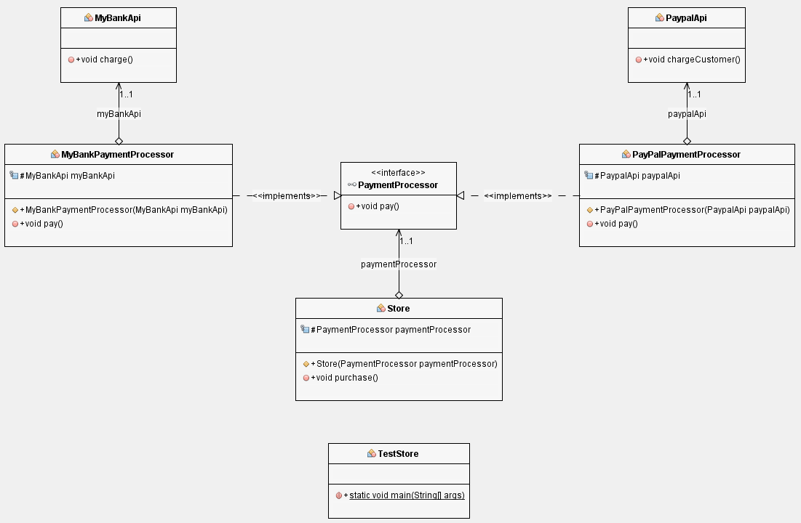

# Dependency Inversion Principle (DIP)

> Los módulos de alto nivel no deben depender de los módulos de bajo nivel. Ambos deben depender de abstracciones. Las abstracciones no deben depender de los detalles, los detalles deben depender de las abstracciones.

## Qué es una dependencia

Esta se da cuando una clase A usa metodos de una clase B.

## Qué es el acomplamiento

Es el grado de dependencia entre la clase A y la clase B. Si puedo modificar la clase B sin tocar la clase A tenemos un bajo acomplamiento.

## Qué es abstracción

Separar por medio de una operación intelectual un rasgo o cualidad de algo para analizarlos aisladamente.

## Ejemplo del caso de estudio:

El módulo de alto nivel **(Store)** no depende del módulo de bajo nivel **(Bank API)**. Ambos dependen de abstracción **(PaymentProcessor)**. La abstracción **(PaymentProcessor)** no depende de los detalles **(Bank API)**, los detalles **(Bank API)** dependen de una abstracción **(PaymentProcessor)**.

- **Store** (Modulo de alto nivel)
- **Bank API** (Módulo de bajo nivel)
- **Payment Processor** (Interfaz)
- **BankProcessor** (Adaptador del banco)

---

:octocat: [My Github](https://github.com/FernandoCalmet)

