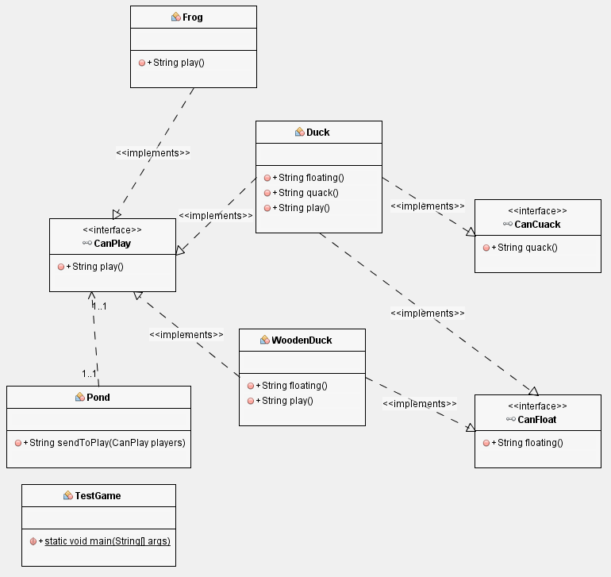

# Interface Segregation Principle (ISP)

> Ningún cliente debe ser forzado a depender de métodos que no usa.

Segregar: Separar, apartar, dividir...

---

:octocat: [My Github](https://github.com/FernandoCalmet)

