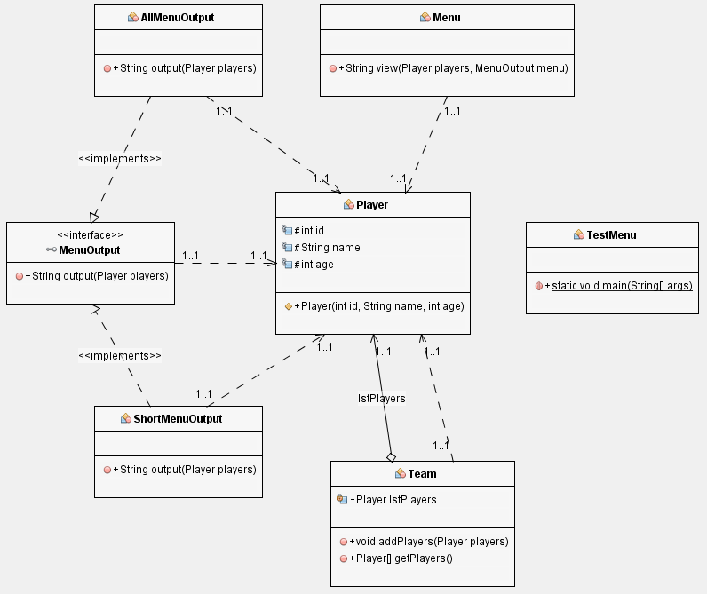

# Open Closed (OCP)

> Las entidades deben estar abiertas para la extensión, pero cerradas para la modificación.

Separa el comportamiento extensible detrás de una interfaz y voltea las dependencias.

---

:octocat: [My Github](https://github.com/FernandoCalmet)

